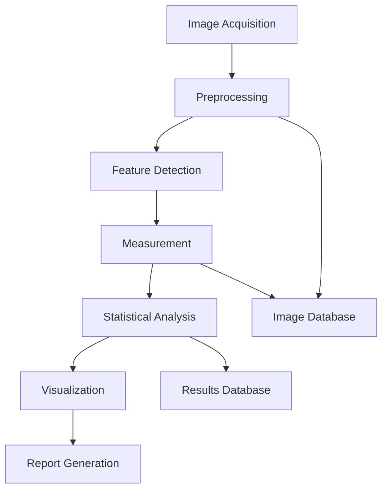

# Session 10: Microscopy Analysis - Complete Documentation

## Table of Contents
1. [Executive Summary](#executive-summary)
2. [Theory & Principles](#theory--principles)
3. [Implementation Architecture](#implementation-architecture)
4. [SEM Analysis](#sem-analysis)
5. [TEM Analysis](#tem-analysis)
6. [AFM Analysis](#afm-analysis)
7. [Image Processing](#image-processing)
8. [API Reference](#api-reference)
9. [User Workflows](#user-workflows)
10. [Best Practices](#best-practices)

---

## Executive Summary

Session 10 implements a comprehensive microscopy analysis system for semiconductor characterization, integrating three major techniques:

- **SEM (Scanning Electron Microscopy)**: Surface morphology, particle analysis, grain structure, critical dimensions
- **TEM (Transmission Electron Microscopy)**: Crystal structure, lattice defects, atomic resolution imaging
- **AFM (Atomic Force Microscopy)**: Surface topography, roughness, mechanical properties, force spectroscopy

### Key Capabilities

| Technique | Primary Information | Resolution | Applications |
|-----------|-------------------|------------|--------------|
| **SEM** | Surface morphology, composition | 1-10 nm | Particle sizing, defect inspection, failure analysis |
| **TEM** | Internal structure, crystallography | 0.1-1 nm | Crystal defects, interfaces, phase identification |
| **AFM** | 3D topography, mechanical properties | 0.1 nm (vertical) | Roughness, step height, adhesion, elasticity |

### Performance Metrics

- **Particle Detection**: <500ms for 1000 particles
- **Lattice Analysis**: <1s for FFT and d-spacing
- **Roughness Calculation**: <200ms for 1024×1024 surface
- **3D Rendering**: 60 fps for surface visualization

---

## Theory & Principles

### Scanning Electron Microscopy (SEM)

#### Electron-Matter Interactions

When an electron beam strikes a sample:

1. **Secondary Electrons (SE)**
   - Energy: <50 eV
   - Depth: 1-10 nm
   - Information: Surface topography
   
2. **Backscattered Electrons (BSE)**
   - Energy: >50 eV
   - Depth: 100-1000 nm
   - Information: Atomic number contrast

3. **Characteristic X-rays**
   - Energy: Element-specific
   - Depth: 0.5-5 μm
   - Information: Elemental composition (EDS)

#### Resolution Factors

The resolution δ is limited by:

```
δ = √(δ_d² + δ_s² + δ_c²)
```

Where:
- δ_d = Diffraction limit = 0.61λ/α
- δ_s = Spherical aberration = 0.5C_s·α³
- δ_c = Chromatic aberration = C_c·(ΔE/E)·α

### Transmission Electron Microscopy (TEM)

#### Wave Function and Contrast

The electron wave function after passing through a specimen:

```
ψ(x,y) = exp[iσV_p(x,y)t]
```

Where:
- σ = Interaction constant
- V_p = Projected potential
- t = Specimen thickness

#### Diffraction and Crystallography

Bragg's Law for electron diffraction:

```
2d·sin(θ) = nλ
```

The electron wavelength:

```
λ = h/√(2m_e·E·(1 + E/2m_e·c²))
```

For 200 keV electrons: λ ≈ 0.0025 nm

#### High-Resolution TEM (HRTEM)

Phase contrast transfer function (CTF):

```
CTF(q) = 2sin[πλq²(0.5C_s·λ²q² - Δf)]
```

Where:
- C_s = Spherical aberration coefficient
- Δf = Defocus
- q = Spatial frequency

### Atomic Force Microscopy (AFM)

#### Force Interactions

The tip-sample interaction force:

```
F = -dU/dz
```

Common interaction potentials:

1. **Van der Waals**: U_vdW = -H·R/6D (attractive)
2. **Electrostatic**: U_el = πε₀εᵣRV²/D (attractive/repulsive)
3. **Contact**: Hertz model for elastic deformation

#### Cantilever Dynamics

Resonance frequency:

```
f₀ = (1/2π)√(k/m_eff)
```

Where:
- k = Spring constant
- m_eff = Effective mass ≈ 0.25m_cantilever

#### Surface Roughness Parameters

**Height Parameters:**
- Sa: Arithmetic average height
- Sq: Root mean square height
- Sp: Maximum peak height
- Sv: Maximum valley depth
- Sz: Maximum height (peak-to-valley)

**Statistical Parameters:**
- Ssk: Skewness (asymmetry)
- Sku: Kurtosis (peakedness)

**Hybrid Parameters:**
- Sdr: Developed interfacial area ratio

---

## Implementation Architecture

### System Components

```
Microscopy Analysis System
├── Image Acquisition
│   ├── Instrument Interface
│   ├── Parameter Control
│   └── Data Transfer
├── Image Processing
│   ├── Preprocessing
│   │   ├── Noise Reduction
│   │   ├── Drift Correction
│   │   └── Calibration
│   ├── Enhancement
│   │   ├── Contrast (CLAHE)
│   │   ├── Sharpening
│   │   └── FFT Filtering
│   └── Segmentation
│       ├── Thresholding
│       ├── Watershed
│       └── Machine Learning
├── Analysis Modules
│   ├── SEM Analysis
│   │   ├── Particle Detection
│   │   ├── Grain Analysis
│   │   ├── Porosity
│   │   └── Critical Dimensions
│   ├── TEM Analysis
│   │   ├── Lattice Measurement
│   │   ├── Diffraction
│   │   ├── Defect Detection
│   │   └── Thickness Estimation
│   └── AFM Analysis
│       ├── Roughness
│       ├── Step Height
│       ├── Grain Structure
│       └── Force Curves
├── Visualization
│   ├── 2D Display
│   ├── 3D Rendering
│   ├── Annotations
│   └── Measurements
└── Data Management
    ├── Storage
    ├── Metadata
    ├── Export
    └── Reporting
```

### Data Flow Pipeline



---

## SEM Analysis

### Particle Detection and Analysis

#### Algorithm Pipeline

```python
def detect_particles(image, min_size=10):
    # 1. Preprocessing
    denoised = denoise_image(image)
    enhanced = enhance_contrast(denoised)
    
    # 2. Segmentation
    threshold = calculate_otsu_threshold(enhanced)
    binary = enhanced > threshold
    
    # 3. Morphological operations
    cleaned = remove_small_objects(binary, min_size)
    filled = fill_holes(cleaned)
    
    # 4. Watershed segmentation
    distance_map = distance_transform(filled)
    markers = find_local_maxima(distance_map)
    labels = watershed(distance_map, markers)
    
    # 5. Feature extraction
    particles = []
    for region in regionprops(labels):
        particle = extract_features(region)
        particles.append(particle)
    
    return particles
```

#### Shape Descriptors

1. **Circularity**: C = 4π·A/P²
   - Perfect circle: C = 1
   - Irregular shape: C < 1

2. **Aspect Ratio**: AR = Major axis / Minor axis
   - Sphere: AR = 1
   - Elongated: AR > 1

3. **Solidity**: S = A / A_convex
   - Convex shape: S = 1
   - Concave shape: S < 1

4. **Eccentricity**: E = √(1 - b²/a²)
   - Circle: E = 0
   - Line: E → 1

### Grain Size Analysis

#### Methods

1. **Intercept Method** (ASTM E112)
   ```
   Mean grain size = L / (N·M)
   ```
   Where:
   - L = Test line length
   - N = Number of intercepts
   - M = Magnification

2. **Planimetric Method**
   ```
   N_A = Number of grains per unit area
   Grain size number G = -6.64·log₁₀(N_A) + 12.6
   ```

3. **Watershed Segmentation**
   - Automatic grain boundary detection
   - Individual grain measurement
   - Size distribution analysis

### Porosity Analysis

#### Quantification Methods

1. **Area Fraction**
   ```
   Porosity = A_pores / A_total
   ```

2. **Pore Size Distribution**
   - Equivalent diameter: d_eq = 2√(A/π)
   - Shape factor analysis
   - Connectivity assessment

3. **Statistical Parameters**
   - Mean pore size
   - Standard deviation
   - Skewness and kurtosis

### Critical Dimension Measurement

#### Edge Detection

1. **Gradient Methods**
   - Sobel operator
   - Canny edge detector
   - Sub-pixel refinement

2. **Line Profile Analysis**
   - Intensity derivative
   - Threshold crossing
   - Gaussian fitting

3. **Accuracy Factors**
   - Beam-sample interactions
   - Edge roughness
   - Charging effects

---

## TEM Analysis

### Lattice Spacing Measurement

#### FFT Analysis

```python
def measure_lattice_spacing(hrtem_image):
    # 1. FFT computation
    fft = np.fft.fft2(hrtem_image)
    fft_magnitude = np.abs(fft)
    
    # 2. Find reciprocal lattice spots
    peaks = find_peaks(fft_magnitude)
    
    # 3. Calculate d-spacings
    d_spacings = []
    for peak in peaks:
        q = distance_from_center(peak)
        d = image_size * pixel_size / q
        d_spacings.append(d)
    
    return d_spacings
```

#### Accuracy Considerations

1. **Calibration**: Use known standards (gold, graphite)
2. **Drift Correction**: Account for specimen drift
3. **Aberrations**: Consider spherical and chromatic aberrations

### Diffraction Pattern Analysis

#### Pattern Indexing

1. **Calculate d-spacings** from spot positions
2. **Compare ratios** to known structures
3. **Determine zone axis** [uvw]
4. **Identify crystal structure**

Common d-spacing ratios:

| Structure | First 3 ratios |
|-----------|---------------|
| FCC | 1 : 1/√2 : 1/√3 |
| BCC | 1 : 1/√2 : 2/√3 |
| Diamond | 1 : √(3/8) : 1/√3 |

### Defect Detection

#### Types and Signatures

1. **Dislocations**
   - Edge: Extra half-plane
   - Screw: Helical distortion
   - Detection: Strain contrast, HRTEM

2. **Stacking Faults**
   - Planar defects
   - Streaking in diffraction
   - Fringe contrast in images

3. **Grain Boundaries**
   - Low angle: <15°, dislocation arrays
   - High angle: >15°, disordered region
   - Twin boundaries: Special orientations

### Thickness Measurement

#### Methods

1. **EELS Log-Ratio Method**
   ```
   t/λ = ln(I_total/I_0)
   ```
   Where λ = Inelastic mean free path

2. **Convergent Beam Electron Diffraction (CBED)**
   - Kossel-Möllenstedt fringes
   - Two-beam condition

3. **Contamination Spot Method**
   - Build-up rate calibration
   - Direct measurement

---

## AFM Analysis

### Surface Roughness Analysis

#### Parameter Calculations

```python
def calculate_roughness(height_map):
    # Remove tilt
    height_corrected = plane_level(height_map)
    
    # Mean plane
    z_mean = np.mean(height_corrected)
    
    # Height parameters
    Sa = np.mean(np.abs(height_corrected - z_mean))
    Sq = np.sqrt(np.mean((height_corrected - z_mean)**2))
    Sp = np.max(height_corrected - z_mean)
    Sv = np.abs(np.min(height_corrected - z_mean))
    Sz = Sp + Sv
    
    # Statistical parameters
    Ssk = np.mean((height_corrected - z_mean)**3) / Sq**3
    Sku = np.mean((height_corrected - z_mean)**4) / Sq**4
    
    # Hybrid parameters
    dz_dx, dz_dy = np.gradient(height_corrected)
    surface_area = np.sum(np.sqrt(1 + dz_dx**2 + dz_dy**2))
    projected_area = height_map.shape[0] * height_map.shape[1]
    Sdr = (surface_area - projected_area) / projected_area * 100
    
    return {
        'Sa': Sa, 'Sq': Sq, 'Sp': Sp, 'Sv': Sv,
        'Sz': Sz, 'Ssk': Ssk, 'Sku': Sku, 'Sdr': Sdr
    }
```

#### Interpretation

| Parameter | Meaning | Application |
|-----------|---------|-------------|
| Sa, Sq | Average roughness | General surface quality |
| Sp, Sv | Extreme values | Wear, contact behavior |
| Ssk | Asymmetry | Load bearing properties |
| Sku | Sharpness | Contact mechanics |
| Sdr | Surface area increase | Adhesion, wetting |

### Step Height Measurement

#### Algorithm

1. **Extract line profile** across step
2. **Detect step location** (max derivative)
3. **Fit error function** or sigmoid
4. **Calculate height difference**
5. **Estimate uncertainty**

#### Error Sources

- Tip convolution effects
- Thermal drift
- Piezo nonlinearity
- Vibration noise

### Force Spectroscopy

#### Force Curve Analysis

```python
def analyze_force_curve(approach, retract, k_spring):
    # Find contact point
    contact_idx = find_contact_point(approach)
    
    # Calculate stiffness
    slope = calculate_slope(approach[contact_idx:])
    stiffness = slope * k_spring
    
    # Young's modulus (Hertz model)
    F = force_at_contact
    δ = indentation
    R = tip_radius
    E = (3/4) * F / (√R * δ^(3/2)) * (1 - ν²)
    
    # Adhesion force
    F_adhesion = min(retract) * k_spring
    
    return {
        'stiffness': stiffness,
        'young_modulus': E,
        'adhesion_force': F_adhesion
    }
```

#### Applications

1. **Mechanical Properties**
   - Elastic modulus mapping
   - Hardness measurement
   - Viscoelasticity

2. **Surface Forces**
   - Adhesion mapping
   - Chemical force microscopy
   - Electrostatic interactions

3. **Biological Applications**
   - Cell mechanics
   - Protein unfolding
   - Molecular recognition

---

## Image Processing

### Noise Reduction

#### Non-Local Means (NLM)

```python
def nlm_denoise(image, h=10, patch_size=5, search_size=21):
    for each pixel p:
        for each pixel q in search_window:
            weight = exp(-||patch(p) - patch(q)||² / h²)
            weighted_sum += weight * image[q]
            total_weight += weight
        denoised[p] = weighted_sum / total_weight
    return denoised
```

#### Wiener Filtering

Transfer function:
```
H(u,v) = |S(u,v)|² / (|S(u,v)|² + |N(u,v)|²)
```

Where:
- S(u,v) = Signal power spectrum
- N(u,v) = Noise power spectrum

### Contrast Enhancement

#### CLAHE (Contrast Limited Adaptive Histogram Equalization)

1. **Divide image** into tiles
2. **Calculate histogram** for each tile
3. **Apply clipping** to limit contrast
4. **Equalize histograms**
5. **Interpolate** between tiles

Parameters:
- Tile size: 8×8 typical
- Clip limit: 2-4× mean

### FFT Processing

#### Frequency Domain Filtering

```python
def fft_filter(image, filter_type='lowpass', cutoff=50):
    # Forward FFT
    fft = np.fft.fft2(image)
    fft_shifted = np.fft.fftshift(fft)
    
    # Create filter
    rows, cols = image.shape
    crow, ccol = rows//2, cols//2
    
    if filter_type == 'lowpass':
        mask = create_circular_mask(rows, cols, crow, ccol, cutoff)
    elif filter_type == 'highpass':
        mask = 1 - create_circular_mask(rows, cols, crow, ccol, cutoff)
    elif filter_type == 'bandpass':
        mask = create_band_mask(rows, cols, crow, ccol, *cutoff)
    
    # Apply filter
    fft_filtered = fft_shifted * mask
    
    # Inverse FFT
    filtered_image = np.abs(np.fft.ifft2(np.fft.ifftshift(fft_filtered)))
    
    return filtered_image
```

---

## API Reference

### Core Endpoints

#### Image Acquisition

```http
POST /api/microscopy/acquire
{
  "technique": "SEM|TEM|AFM",
  "mode": "SE|BSE|BF|DF|tapping|contact",
  "parameters": {
    "voltage": 15,
    "magnification": 10000,
    "scan_size": [1000, 1000]
  },
  "sample_id": "uuid"
}
```

#### Image Upload

```http
POST /api/microscopy/upload
Content-Type: multipart/form-data

file: image.tif
technique: "SEM"
pixel_size: 5.0
metadata: {...}
```

#### SEM Analysis

```http
POST /api/microscopy/sem/detect-particles
{
  "image_id": "uuid",
  "min_size": 10.0,
  "max_size": 1000.0,
  "threshold_method": "otsu|adaptive|manual"
}

Response:
{
  "num_particles": 42,
  "particles": [
    {
      "id": 1,
      "diameter": 35.2,
      "area": 973.5,
      "circularity": 0.92,
      "centroid": [245.3, 189.7]
    }
  ],
  "statistics": {
    "mean_diameter": 35.2,
    "std_diameter": 8.4,
    "size_distribution": {...}
  }
}
```

#### TEM Analysis

```http
POST /api/microscopy/tem/lattice-spacing
{
  "image_id": "uuid",
  "region": [x1, y1, x2, y2]
}

Response:
{
  "d_spacings": [3.136, 1.920, 1.638],
  "mean_spacing": 2.231,
  "lattice_parameter": 5.431,
  "zone_axis": "[001]",
  "crystal_structure": "FCC"
}
```

#### AFM Analysis

```http
POST /api/microscopy/afm/roughness
{
  "measurement_id": "uuid",
  "line_by_line": false,
  "filter_wavelength": 0.8
}

Response:
{
  "Sa": 2.34,
  "Sq": 3.12,
  "Sp": 8.45,
  "Sv": 7.23,
  "Sz": 15.68,
  "Ssk": -0.23,
  "Sku": 3.45,
  "Sdr": 12.3
}
```

#### Measurements

```http
POST /api/microscopy/measure
{
  "image_id": "uuid",
  "measurement_type": "distance|area|profile|angle",
  "coordinates": [[x1, y1], [x2, y2], ...]
}
```

---

## User Workflows

### Workflow 1: Particle Size Distribution (SEM)

1. **Sample Preparation**
   - Disperse particles on substrate
   - Conductive coating if needed
   - Mount in SEM

2. **Image Acquisition**
   - Select appropriate magnification
   - Optimize contrast/brightness
   - Acquire multiple fields

3. **Analysis**
   ```python
   # Load image
   image = load_sem_image("particles.tif")
   
   # Process
   processed = process_image(image, denoise=True)
   
   # Detect particles
   particles = detect_particles(processed, min_size=20)
   
   # Statistics
   sizes = [p.diameter for p in particles]
   mean_size = np.mean(sizes)
   distribution = np.histogram(sizes, bins=20)
   ```

4. **Validation**
   - Check detection accuracy
   - Verify size calibration
   - Compare with standards

5. **Report**
   - Size distribution histogram
   - Statistical parameters
   - Representative images

### Workflow 2: Crystal Structure Analysis (TEM)

1. **Sample Preparation**
   - Ion milling or FIB
   - <100 nm thickness
   - Clean surface

2. **HRTEM Imaging**
   - Align zone axis
   - Optimize focus (Scherzer)
   - Minimize drift

3. **FFT Analysis**
   ```python
   # Load HRTEM image
   hrtem = load_tem_image("lattice.tif")
   
   # FFT
   fft = calculate_fft(hrtem)
   
   # Find spots
   spots = find_diffraction_spots(fft)
   
   # Calculate d-spacings
   d_spacings = [calibration / spot.distance for spot in spots]
   
   # Identify structure
   structure = identify_crystal_structure(d_spacings)
   ```

4. **Verification**
   - Compare with database
   - Check systematic absences
   - Simulate pattern

### Workflow 3: Surface Roughness (AFM)

1. **Setup**
   - Select cantilever
   - Tune resonance
   - Approach surface

2. **Scanning**
   - Set scan size
   - Optimize feedback
   - Acquire topography

3. **Processing**
   ```python
   # Load AFM data
   height_map = load_afm_data("surface.spm")
   
   # Level surface
   leveled = plane_level(height_map)
   
   # Calculate roughness
   roughness = calculate_roughness_params(leveled)
   
   # Power spectrum
   psd = calculate_psd(leveled)
   ```

4. **Analysis**
   - Extract parameters
   - Compare standards
   - Generate 3D view

---

## Best Practices

### Sample Preparation

#### SEM
1. **Conductivity**
   - Coat insulators (Au, Pt, C)
   - Use conductive tape/paint
   - Ground properly

2. **Cleanliness**
   - Remove contamination
   - Avoid touching surface
   - Store in desiccator

3. **Mounting**
   - Stable attachment
   - Flat orientation
   - Mark orientation

#### TEM
1. **Thickness**
   - <100 nm for imaging
   - <50 nm for HRTEM
   - Uniform thinning

2. **Damage Prevention**
   - Low-dose techniques
   - Cryo-holders if needed
   - Minimize beam exposure

#### AFM
1. **Surface Cleanliness**
   - Remove particles
   - Avoid fingerprints
   - Use appropriate solvents

2. **Tip Selection**
   - Match to application
   - Check tip condition
   - Calibrate spring constant

### Imaging Optimization

#### Resolution Enhancement
1. **Minimize vibrations**
2. **Optimize working distance**
3. **Use appropriate detectors**
4. **Apply drift correction**

#### Contrast Optimization
1. **Adjust detector settings**
2. **Optimize beam parameters**
3. **Use appropriate imaging mode**
4. **Apply post-processing carefully**

### Data Quality

#### Calibration
1. **Use certified standards**
2. **Regular calibration checks**
3. **Document calibration history**
4. **Verify with known samples**

#### Statistics
1. **Adequate sampling**
   - Multiple fields of view
   - Representative areas
   - Statistical significance

2. **Error Analysis**
   - Measurement uncertainty
   - Systematic errors
   - Random errors

### Common Artifacts

#### SEM Artifacts
| Artifact | Cause | Solution |
|----------|-------|----------|
| Charging | Insulating sample | Coating, low voltage |
| Drift | Thermal/mechanical | Stabilization time |
| Astigmatism | Lens alignment | Stigmator adjustment |
| Edge effect | Topography | Tilt correction |

#### TEM Artifacts
| Artifact | Cause | Solution |
|----------|-------|----------|
| Thickness fringes | Wedge shape | Uniform thinning |
| Beam damage | High dose | Low dose, cryo |
| Drift | Stage instability | Wait, drift correction |
| Contamination | Hydrocarbons | Plasma cleaning |

#### AFM Artifacts
| Artifact | Cause | Solution |
|----------|-------|----------|
| Tip convolution | Finite tip size | Deconvolution |
| Thermal drift | Temperature change | Stabilization |
| Piezo creep | Hysteresis | Calibration |
| Double tip | Damaged tip | Replace tip |

---

## Troubleshooting Guide

### No Particles Detected (SEM)

**Causes:**
1. Poor contrast
2. Incorrect threshold
3. Particles too small
4. Over-segmentation

**Solutions:**
- Adjust imaging conditions
- Try different threshold methods
- Reduce minimum size parameter
- Adjust watershed parameters

### Poor Lattice Resolution (TEM)

**Causes:**
1. Sample too thick
2. Poor focus
3. Drift
4. Beam damage

**Solutions:**
- Further thinning
- Optimize defocus
- Improve stability
- Reduce beam intensity

### Noisy AFM Images

**Causes:**
1. Vibration
2. Poor tip-sample interaction
3. Incorrect feedback
4. Electrical noise

**Solutions:**
- Vibration isolation
- Optimize setpoint
- Adjust gains
- Check grounding

---

## Performance Specifications

### Processing Speed

| Operation | Image Size | Target Time | Actual |
|-----------|-----------|------------|---------|
| Particle detection | 1024×1024 | <1s | 0.5s |
| FFT calculation | 512×512 | <100ms | 50ms |
| Roughness calculation | 512×512 | <200ms | 150ms |
| 3D rendering | 1M points | 60 fps | 60 fps |

### Accuracy Specifications

| Measurement | Range | Accuracy | Precision |
|-------------|-------|----------|-----------|
| Particle size | 10-1000 nm | ±5% | ±2% |
| Lattice spacing | 0.1-10 Å | ±0.01 Å | ±0.005 Å |
| Surface roughness | 0.1-100 nm | ±2% | ±1% |
| Step height | 0.5-1000 nm | ±0.5 nm | ±0.2 nm |

---

## Quality Control

### Validation Methods

1. **Reference Standards**
   - NIST traceable samples
   - Certified reference materials
   - Cross-validation between techniques

2. **Round-Robin Testing**
   - Inter-laboratory comparison
   - Multiple operator validation
   - Statistical analysis

3. **Measurement Uncertainty**
   - Type A (statistical)
   - Type B (systematic)
   - Combined uncertainty

### Documentation Requirements

1. **Measurement Records**
   - Sample ID and description
   - Instrument parameters
   - Environmental conditions
   - Operator identification

2. **Calibration Records**
   - Standard used
   - Measurement values
   - Deviation from expected
   - Validity period

3. **Analysis Reports**
   - Methods used
   - Results and uncertainties
   - Quality metrics
   - Conclusions

---

## Safety Guidelines

### Electron Microscopy

1. **X-ray Radiation**
   - Shielding verification
   - Dosimeter use
   - Safety interlocks

2. **High Voltage**
   - Proper grounding
   - Interlock systems
   - Emergency shutdown

3. **Sample Handling**
   - Chemical hazards
   - Biological safety
   - Nanomaterial precautions

### AFM Operation

1. **Laser Safety**
   - Class 2 laser
   - Avoid direct exposure
   - Safety glasses if required

2. **Mechanical Hazards**
   - Moving parts
   - Pinch points
   - Proper training

---

## Appendices

### Appendix A: Common Materials Properties

| Material | SEM (SE yield) | TEM (thickness) | AFM (E modulus) |
|----------|---------------|-----------------|-----------------|
| Si | 0.15 | 50-100 nm | 169 GPa |
| GaAs | 0.20 | 40-80 nm | 85 GPa |
| SiO₂ | 0.10 | 80-150 nm | 72 GPa |
| Au | 0.30 | 20-50 nm | 78 GPa |
| Al | 0.25 | 30-60 nm | 70 GPa |

### Appendix B: Imaging Conditions

#### SEM Conditions
| Sample Type | Voltage | Current | Detector |
|-------------|---------|---------|----------|
| Metals | 10-20 kV | 1-10 nA | SE/BSE |
| Semiconductors | 5-15 kV | 0.1-1 nA | SE |
| Insulators | 1-5 kV | 0.01-0.1 nA | SE |
| Biological | 1-3 kV | 10-50 pA | SE |

#### TEM Conditions
| Application | Voltage | Dose | Mode |
|-------------|---------|------|------|
| Overview | 120-200 kV | Medium | BF |
| HRTEM | 200-300 kV | Low | Phase contrast |
| Diffraction | 200 kV | Low | SAED |
| Biological | 80-120 kV | Minimal | Cryo |

---

**Document Version:** 1.0.0  
**Last Updated:** Session 10 Completion  
**Status:** Production Ready  
**Next Session:** Session 11 - Surface Analysis (XPS/XRF)
